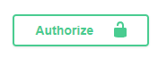
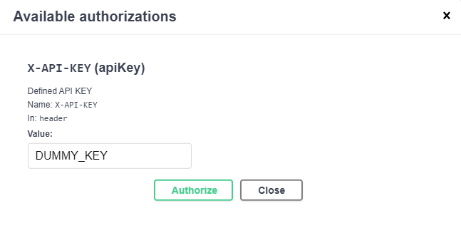

# Cocktails API

## Description

API for cocktails receipes. Build with [NestJS](https://github.com/nestjs/nest) + [TypeORM](https://typeorm.io) + [PostgreSQL](https://www.postgresql.org) for practice purpose.

## To check API working go to:

https://cocktails-api.willdv.site

## Installation

### Install dependencies

```bash
npm install
```

### Configure .env file:

```bash
PORT="CUSTOM_PORT" #OPTIONAL
DB_HOST="CUSTOM_DB_HOST"
DB_PORT="CUSTOM_DB_PORT"
DB_NAME="CUSTOM_DB_NAME"
DB_USERNAME="CUSTOM_DB_USERNAME"
DB_PASSWORD="CUSTOM_DB_PASSWORD"
ALLOWED_API_KEYS="CUSTOM_ALLOWED_API_KEYS"
```

### Configure Postgres DB (OPTIONAL)

1. Install [docker](https://www.docker.com) and [docker compose](https://docs.docker.com/compose/install/)
2. Up a PostgresDB container with [docker-compose.yml](./docker-compose.yml) file:

```bash
docker compose up -d
```

### Execute migrations

```bash
npm run typeorm migration:run -- -d ./src/db/datasource.ts
```

## Running the app

```bash
# development
$ npm run start

# watch mode
$ npm run start:dev

# production mode
$ npm run start:prod
```

## Test

```bash
# unit tests
$ npm run test

# e2e tests
$ npm run test:e2e

# test coverage
$ npm run test:cov
```

## Trying the app

Run the app and access to app URL. By default http://127.0.0.1:3000

You can try GET methods without setting an API KEY.

To try POST, PUT and DELETE:

1. Access to login form with Authorize button

   

2. Set API KEY you defined on ALLOWED_API_KEYS .env
   
